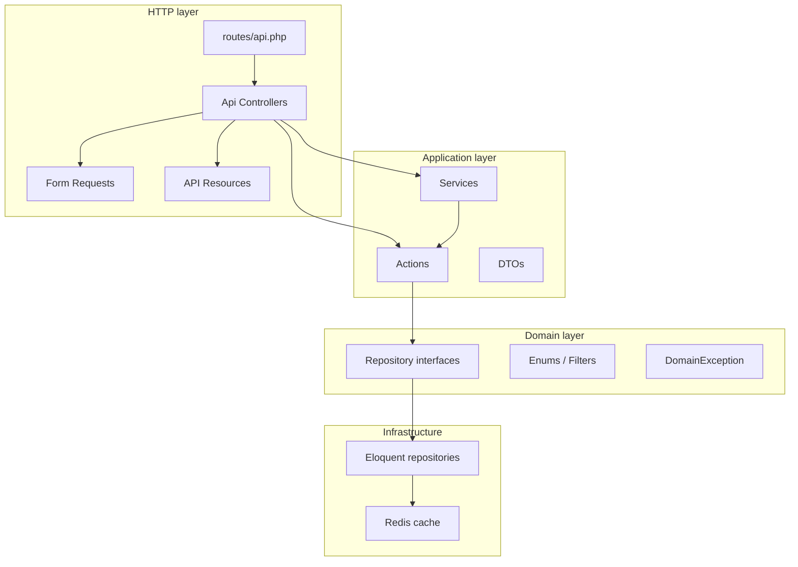
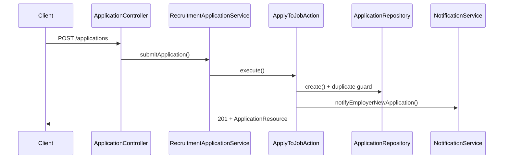

# Laravel Recruitment Platform API

[](https://github.com/sameh-bakleh/laravel-recruitment-platform-api/actions/workflows/ci.yml)


| | |
|---|---|
| **Repo** | [`laravel-recruitment-platform-api`](https://github.com/sameh-bakleh/laravel-recruitment-platform-api) |
| **Stack** | Laravel 12 · PHP 8.3 · JWT · MySQL · Redis · OpenAPI · Docker |

**ATS-style recruitment backend** — JWT auth, RBAC, versioned REST API, employer application workflows, Redis caching, queued notifications, OpenAPI contract, Docker, and 45 PHPUnit tests in CI.

> **30-second summary for recruiters:** Production-style Laravel API for a job portal / applicant tracking system. Demonstrates layered architecture (Actions, repositories, policies), secure multi-role access, validated HTTP boundaries, and automated tests — not a tutorial CRUD app. Synthetic demo data only; no real users or credentials.

---

## Evaluate in 10 minutes

### Run with Docker

```bash
git clone https://github.com/sameh-bakleh/laravel-recruitment-platform-api.git
cd laravel-recruitment-platform-api
cp .env.example .env
docker compose up --build
```

The `app` container runs `composer install`, `php artisan migrate --force`, and `php artisan db:seed --force` on startup, then serves on port **8000**.

| URL | Purpose |
|-----|---------|
| `http://localhost:8000/api/v1` | API base |
| `http://localhost:8000/up` | Health check |

### Example requests

```bash
# Public job catalog
curl -s http://localhost:8000/api/v1/job-listings | head

# Login (seeded candidate — password: password)
curl -s -X POST http://localhost:8000/api/v1/auth/login \
  -H 'Content-Type: application/json' \
  -d '{"email":"candidate@example.com","password":"password"}'

# Authenticated applications list (paste token from login response)
curl -s http://localhost:8000/api/v1/applications \
  -H "Authorization: Bearer YOUR_TOKEN"
```

### API documentation

This repo ships an OpenAPI 3 contract as [`openapi.yaml`](openapi.yaml) (no Swagger UI). Human-readable reference: [`docs/api.md`](docs/api.md).

### Tests

```bash
composer install
composer test           # 45 PHPUnit tests (SQLite in-memory)
vendor/bin/pint --test  # Laravel Pint (runs in CI)
```

---

## What is this?

A **reference backend** for a recruitment SaaS: companies post jobs, candidates apply, employers move applications through an ATS pipeline (`pending` → `shortlisted` → `hired`). API-first — no frontend bundled.

| Persona | Capabilities |
|---------|--------------|
| **Candidate** (`job_seeker`) | Profile, apply, saved jobs, recommendations |
| **Employer** (`company`) | Company profile, job CRUD, review applications, update status |
| **Admin** | User administration |

Base URL: `/api/v1` · Health: `GET /up` · Contract: [`openapi.yaml`](openapi.yaml) · Docs: [`docs/api.md`](docs/api.md), [`docs/auth-and-rbac.md`](docs/auth-and-rbac.md)

---

## Why does it matter?

Typical Laravel portfolio projects stop at auth + CRUD. This one covers patterns common in **German/EU backend roles**:

- Multi-role authorization with defense in depth (middleware, policies, Form Requests)
- Domain rules in use-case Actions, not fat controllers
- Cache invalidation without flushing Redis
- Side effects (notifications) via queues
- Versioned API with OpenAPI documentation
- Feature tests that assert permission boundaries, not just happy paths

---

## Skills this project demonstrates

| Skill | Evidence in repo |
|-------|------------------|
| **PHP 8.x / Laravel 12** | `composer.json`, strict types across `app/` |
| **REST API design** | Versioned routes, consistent JSON via API Resources |
| **JWT authentication** | Register, login, refresh, logout (`tymon/jwt-auth`) |
| **RBAC** | `EnsureUserHasRole` middleware + Policies + `authorize()` on Form Requests |
| **Validation** | Dedicated Form Request classes per endpoint |
| **Service / use-case layer** | `app/Actions/`, `app/Services/` |
| **Repository pattern** | `Domain/Repositories/*` → `Infrastructure/Persistence/*` |
| **MySQL / PostgreSQL** | Docker MySQL; `DB_CONNECTION=pgsql` documented in `.env.example` |
| **Redis** | Published job catalog cache with version counter (`predis/predis`) |
| **Queues** | `ShouldQueue` notifications; database queue driver |
| **Docker** | `docker-compose.yml` — app + MySQL 8 + Redis 7 |
| **OpenAPI** | `openapi.yaml` (~24 paths) |
| **PHPUnit** | 45 tests — auth, validation, RBAC, cache, core flows |
| **CI/CD** | GitHub Actions — Laravel Pint + PHPUnit on PHP 8.3 |

---

## Architecture overview

Dependencies point inward: **HTTP → Actions / Services → repository interfaces → Eloquent**.



### Request flow (candidate applies to a job)



**Conscious trade-offs:** Recommendations use in-memory scoring (no ML). Job search is SQL-based — Elasticsearch would be a natural extension for full-text search at scale. `resume_path` is a string field — no file upload pipeline.

---

## Folder structure

```
app/
├── Actions/                      # Single-purpose use cases
├── Application/DTOs/             # Typed command/query inputs
├── Domain/
│   ├── Enums/                    # UserRole, ApplicationStatus, EmploymentType
│   ├── Exceptions/
│   └── Repositories/             # Interfaces + filter objects
├── Http/
│   ├── Controllers/Api/          # Thin — delegate to Actions/Services
│   ├── Middleware/               # EnsureUserHasRole, OptionalJwtAuthentication
│   ├── Requests/                 # Validation + authorization
│   └── Resources/                # Stable JSON shapes
├── Infrastructure/Persistence/   # Eloquent + Redis cache logic
├── Models/
├── Policies/
├── Services/                     # Catalog, recruitment, notifications, recommendations
└── Notifications/

database/migrations/              # Schema (11 migrations)
database/seeders/                 # Synthetic demo data
tests/Feature/                    # HTTP + RBAC integration tests
tests/Unit/                       # Action-level tests
openapi.yaml                      # OpenAPI 3 contract
docs/api.md                       # Human-readable API reference
docs/auth-and-rbac.md             # JWT + RBAC documentation
docs/GITHUB_DESCRIPTION.txt       # Paste into GitHub repo description
docs/GITHUB_TOPICS.txt            # Paste into GitHub topics
docker-compose.yml                # MySQL + Redis + app
.github/workflows/ci.yml          # Pint + PHPUnit
```

---

## Features

- JWT auth with rate-limited register/login
- RBAC: `admin`, `company`, `job_seeker`
- Job listings: publish/draft, filters, soft deletes, skills
- Applications: duplicate prevention, employer status workflow
- Company & job seeker profiles
- Saved jobs with `is_saved` on optional-auth catalog reads
- Skill-based job recommendations
- Salary analytics aggregation
- Database + mail notifications (queued)
- Redis-backed catalog cache with version invalidation

---

## Tech stack

| Layer | Technology |
|-------|------------|
| Runtime | PHP 8.2+ (Docker: 8.3) |
| Framework | Laravel 12 |
| Auth | JWT (`tymon/jwt-auth`) |
| Database | MySQL 8 · SQLite (tests) · PostgreSQL-ready |
| Cache | Redis (`predis/predis`) |
| Queue | Database driver |
| API docs | OpenAPI 3 |
| Tests | PHPUnit 11 |
| Style | Laravel Pint |
| Containers | Docker Compose |

---

## Auth & RBAC

See **[docs/auth-and-rbac.md](docs/auth-and-rbac.md)** for JWT flow, middleware, policies, and the full permission matrix.

| Role | Access |
|------|--------|
| `job_seeker` | Apply, profile, saved jobs, recommendations |
| `company` | Company profile, job CRUD, application review |
| `admin` | Candidate routes + `GET /admin/users` |

**Enforcement:** route middleware → Policies → Form Request `authorize()`. Self-registration limited to `job_seeker` and `company` (not `admin`).

---

## Database

| Table | Role |
|-------|------|
| `users` | Accounts + `role` |
| `companies` | Employer profiles |
| `job_seeker_profiles` | Skills, preferences |
| `job_listings` | Jobs (soft deletes, JSON skills) |
| `applications` | Unique (job, user) constraint |
| `saved_jobs` | Candidate bookmarks |
| `notifications` | In-app notifications |

---

## Main endpoints

See **[docs/api.md](docs/api.md)** for request/response examples and smoke-test commands.

| Method | Path | Auth |
|--------|------|------|
| POST | `/auth/register`, `/auth/login` | Public (rate-limited) |
| POST | `/auth/refresh`, `/auth/logout` | JWT |
| GET | `/auth/me` | JWT |
| GET | `/job-listings`, `/job-listings/{id}` | Optional JWT |
| POST/PUT/DELETE | `/job-listings/{id}` | JWT + policy |
| GET/POST | `/applications` | JWT |
| PATCH | `/applications/{id}/status` | JWT (employer) |
| GET/PUT | `/companies/me/profile` | JWT `company` |
| GET/PUT | `/me/profile/job-seeker` | JWT seeker |
| GET | `/salary-analytics` | Public |

Full list: [`openapi.yaml`](openapi.yaml)

---

## How to run

### Local (SQLite)

```bash
composer install
cp .env.example .env
php artisan key:generate
php artisan jwt:secret
php artisan migrate --seed
php artisan serve
```

API: `http://127.0.0.1:8000/api/v1`

### Docker (MySQL + Redis)

See **[Evaluate in 10 minutes](#evaluate-in-10-minutes)** for the full quickstart. Summary:

```bash
docker compose up --build
```

| Service | Endpoint |
|---------|----------|
| API | `http://localhost:8000` |
| MySQL | `localhost:3307` |
| Redis | `localhost:6380` |

### Demo users (after seed)

| Role | Email | Password |
|------|--------|----------|
| Admin | `admin@example.com` | `password` |
| Employer | `employer@example.com` | `password` |
| Candidate | `candidate@example.com` | `password` |

Queues: `php artisan queue:work` (or `QUEUE_CONNECTION=sync` for demos).

---

## How to test

```bash
composer test     # 45 PHPUnit tests
composer lint       # Laravel Pint (dry run)
```

PHPUnit uses in-memory SQLite, `CACHE_STORE=array`, `QUEUE_CONNECTION=sync` (`phpunit.xml`).

| Suite | What it proves |
|-------|----------------|
| `AuthApiTest` | JWT lifecycle, validation, role guard |
| `JobListingApiTest` | Catalog, CRUD, RBAC, unpublished guard |
| `ApplicationEmployerApiTest` | Apply, duplicate block, cross-company denial |
| `SavedJobApiTest` | Save/unsave, optional-auth `is_saved` |
| `NotificationApiTest` | Queued notification on apply |
| `CompanyProfileApiTest` / `JobSeekerProfileApiTest` | Profile CRUD + RBAC |
| `AdminApiTest` | Admin-only routes |
| `SalaryAnalyticsApiTest` | Public analytics |
| `RecommendationApiTest` | Skill-based recommendations + RBAC |
| `JobListingCacheTest` | Redis list-cache version invalidation |

---

## CI/CD

GitHub Actions (`.github/workflows/ci.yml`) on every push/PR to `main` / `master` and via **workflow_dispatch**:

1. **Install** — `composer install` (with dependency cache)
2. **Lint** — `./vendor/bin/pint --test`
3. **Test** — `php artisan test` on PHP 8.3 + SQLite

See [CONTRIBUTING.md](CONTRIBUTING.md) for local checks before opening a PR.

---

## Security & privacy

- Portfolio sample only — **synthetic** `@example.com` seed data
- `.env` is gitignored; never commit secrets
- Demo passwords are for local/Docker use
- Auth endpoints rate-limited
- See [`SECURITY.md`](SECURITY.md) for reporting and known limits

---

## Why recruiters should care

If you are hiring for **PHP Backend**, **Laravel**, **API Engineer**, or **Software Engineer** (Germany/EU), this repo shows:

1. **Architecture discipline** — business logic is testable and separated from HTTP
2. **Security awareness** — RBAC tested at permission boundaries, not only happy paths
3. **Operational basics** — Docker, Redis, queues, CI
4. **Communication** — OpenAPI contract, readable README, honest scope

It pairs with mobile portfolio work (iOS/Android clients) as the **backend counterpart** — same REST/JWT patterns recruiters see in full-stack teams.

---

## License

[MIT](LICENSE)
