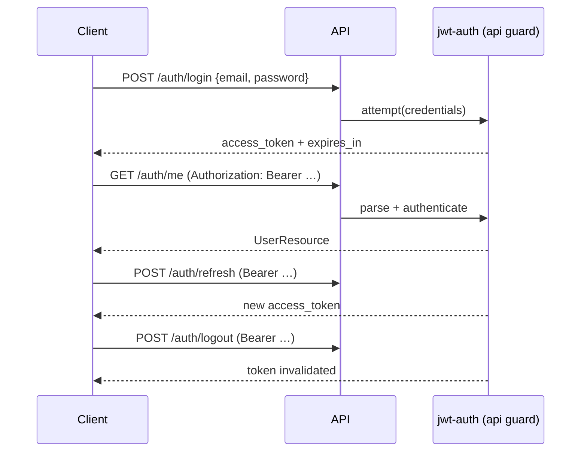

# Authentication & RBAC

This API uses **JWT bearer tokens** via [`tymon/jwt-auth`](https://github.com/tymondesigns/jwt-auth) on the `api` guard. Role-based access control (RBAC) is enforced in **three layers** so permission checks are hard to bypass accidentally.

---

## Roles

| Role | Value | Typical persona |
|------|-------|-----------------|
| Admin | `admin` | Platform operator |
| Employer | `company` | Hiring company / recruiter |
| Candidate | `job_seeker` | Applicant |

Roles are stored on `users.role` as a backed PHP enum (`App\Domain\Enums\UserRole`).

**Registration rules:**

- Self-registration allows `job_seeker` (default) or `company` only.
- `admin` cannot be chosen at register — validated in `RegisterRequest` and rejected with `422`.
- Admin accounts are created via seeders or direct DB/admin tooling.

---

## JWT authentication flow



**Configuration** (`.env`):

| Variable | Purpose |
|----------|---------|
| `JWT_SECRET` | Signing key — run `php artisan jwt:secret` |
| `JWT_TTL` | Token lifetime in minutes (default `60`) |

**Rate limiting:** `POST /auth/register` and `POST /auth/login` use `throttle:10,1` (10 requests per minute per IP).

**Optional authentication:** `GET /job-listings` and `GET /job-listings/{id}` use the `jwt.optional` middleware. Guests can browse; authenticated job seekers receive `is_saved` on listings.

---

## RBAC enforcement layers

### 1. Route middleware (`role:`)

`EnsureUserHasRole` checks `auth:api` user role against a comma-separated allow list.

```php
// routes/api.php (excerpt)
Route::middleware('role:company')->group(function () {
    Route::post('companies', ...);
    Route::get('companies/me/profile', ...);
});

Route::middleware('role:job_seeker,admin')->group(function () {
    Route::get('me/saved-jobs', ...);
    Route::get('me/recommendations', ...);
});

Route::middleware('role:admin')->group(function () {
    Route::get('admin/users', ...);
});
```

Returns `403` with `{"message":"Forbidden"}` when the role does not match.

### 2. Laravel Policies

Resource ownership and cross-tenant rules live in policies — not only in middleware.

| Policy | Rules |
|--------|-------|
| `JobListingPolicy` | Create: company or admin. Update/delete: listing owner, linked company user, or admin. |
| `ApplicationPolicy` | View: applicant or listing owner. Update status: listing owner only. |

Controllers call `$this->authorize(...)` or Form Requests call `authorize()` before validation.

### 3. Form Request `authorize()`

Examples:

- `StoreJobListingRequest` — delegates to `JobListingPolicy::create`
- `UpdateApplicationStatusRequest` — delegates to `ApplicationPolicy::update`
- `StoreCompanyRequest` — requires `company` role

This keeps HTTP validation and permission checks co-located per endpoint.

---

## Permission matrix

| Capability | `job_seeker` | `company` | `admin` |
|------------|:------------:|:---------:|:-------:|
| Register / login | ✓ | ✓ | — (seed only) |
| Browse published jobs | ✓ | ✓ | ✓ |
| Create job listing | — | ✓ | ✓ |
| Manage own listings | — | ✓ | ✓ |
| Apply to jobs | ✓ | — | ✓ |
| View own applications | ✓ | — | ✓ |
| Review applications (ATS) | — | ✓ (own jobs) | ✓ |
| Company profile CRUD | — | ✓ | — |
| Job seeker profile | ✓ | — | ✓ |
| Saved jobs & recommendations | ✓ | — | ✓ |
| List all users | — | — | ✓ |
| Salary analytics (public) | ✓ | ✓ | ✓ |

Admins inherit candidate routes where middleware lists `job_seeker,admin`.

---

## Application status workflow (ATS)

Employers move applications through a simple pipeline:

```
pending → reviewed → shortlisted → hired
                  ↘ rejected
```

- Only the **listing owner** (or admin via policy) may `PATCH /applications/{id}/status`.
- Candidates cannot change status after applying.
- Employers cannot modify applications for another company's listings (tested in `ApplicationEmployerApiTest`).

Status changes trigger queued notifications to candidates (`ApplicationStatusChangedNotification`).

---

## Security considerations (portfolio scope)

| Topic | Implementation |
|-------|----------------|
| Password hashing | Laravel `bcrypt` / `Hash::make` |
| JWT secret | Environment variable, never committed |
| Mass assignment | `$fillable` on models; DTOs for Actions |
| SQL injection | Eloquent query builder / parameter binding |
| Duplicate applications | DB unique index + repository guard |
| Admin escalation | Registration validation blocks `admin` role |

**Known limits** (documented in [SECURITY.md](../SECURITY.md)):

- Demo seed password is `password` — local use only
- Docker Compose uses development DB credentials
- No refresh-token rotation blacklist beyond jwt-auth defaults
- `resume_path` is not validated file storage

---

## Testing RBAC

Feature tests assert permission boundaries, not only happy paths:

| Test class | What it proves |
|------------|----------------|
| `AuthApiTest` | JWT lifecycle; admin role rejected at register |
| `JobListingApiTest` | Seeker cannot create; owner CRUD |
| `ApplicationEmployerApiTest` | Cross-company status update denied |
| `CompanyProfileApiTest` | Role-gated company routes |
| `JobSeekerProfileApiTest` | Company user blocked from seeker profile |
| `SavedJobApiTest` | Company user cannot save jobs |
| `AdminApiTest` | Admin-only user list |
| `RecommendationApiTest` | Seeker recommendations; company forbidden |

Run: `composer test`
